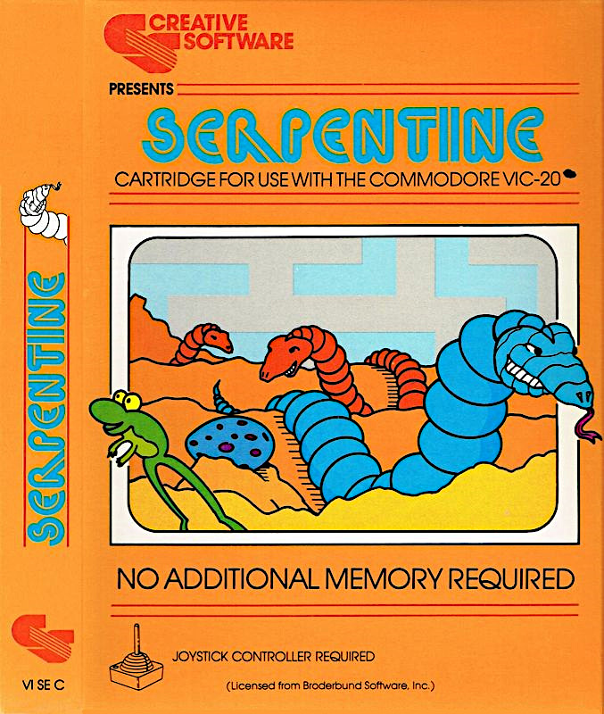

# Serpentine for the Commodore Vic20
Serpentine game disassembly with build scripts for reassembly.

See [Technical analysis](docs/technical-analysis.md) for the program structure, memory map,
bitmap-style rendering architecture, game systems, implementation techniques and preserved quirks.

Originally a cartridge with additional 8K memory at Block 5 (A000), it runs on VICE with this memory enabled and on an expanded Vic20, with memory allocated to block 5, usually via a switchable 35K RAM expansion.

Run `se_build.bat` to build `Serpentine.prg` and `se_run.bat` to start the program in VICE.

